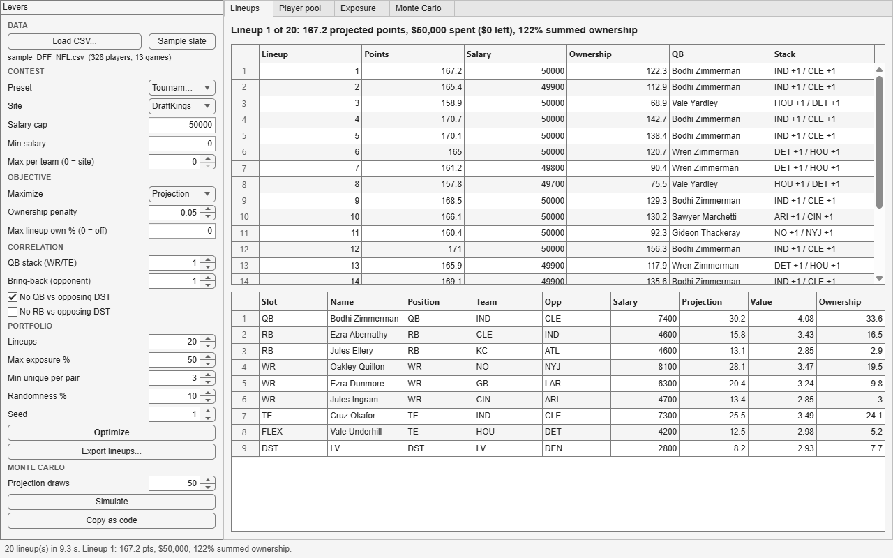
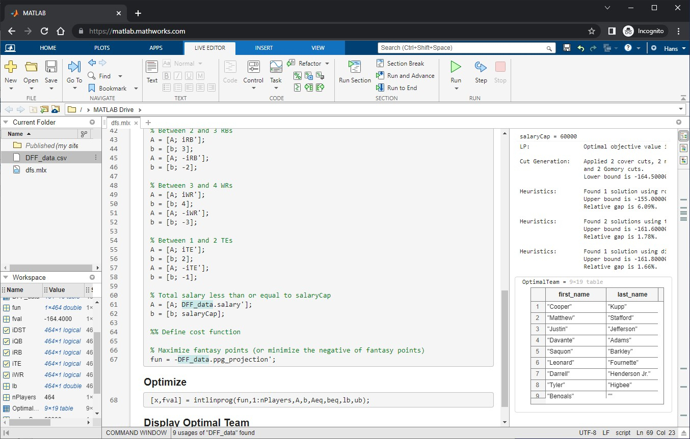
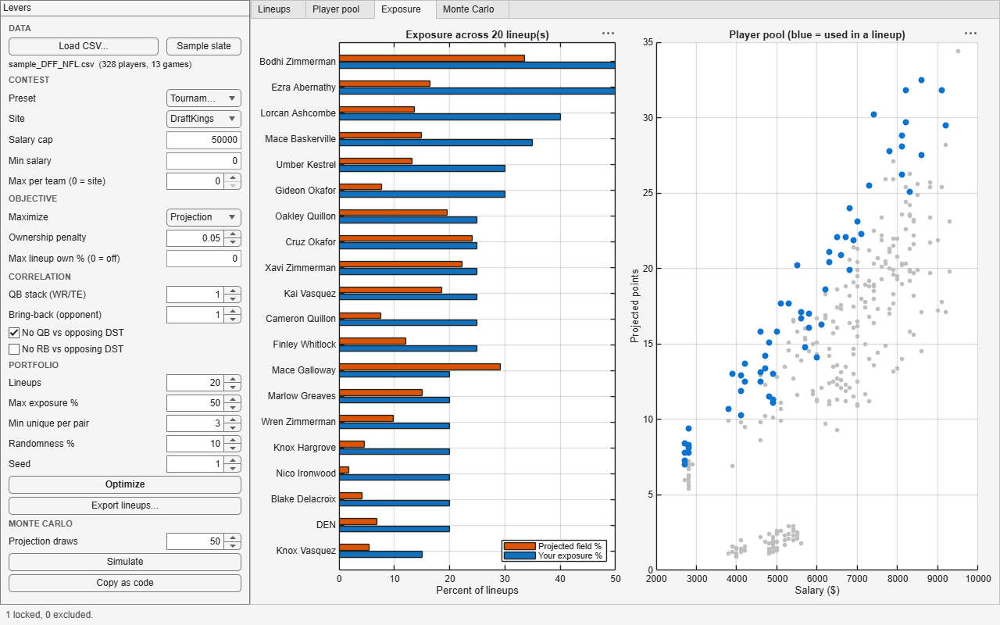

[](https://www.mathworks.com/matlabcentral/fileexchange/117835-dfs-fantasy-football-lineup-optimizer) [](https://matlab.mathworks.com/open/github/v1?repo=nothans/dfs-optimizer&file=dfs.m)

# DFS Lineup Optimizer

Build daily fantasy football lineups with MATLAB and integer programming.
Load a projections CSV, set the levers (site, salary, stacks, ownership, exposure), and the optimizer hands back the best legal lineup, or twenty distinct ones for a tournament, with the math checked twice.



## What you get

- **A lineup solver** built on `intlinprog` through the problem-based Optimization Toolbox interface: one binary variable per player, roster shape, salary cap, and site rules as linear constraints.
- **DraftKings and FanDuel rules** out of the box (cap, FLEX, the DraftKings two-game rule, the FanDuel four-per-team cap), plus custom rule structs for anything else.
- **Tournament structure**: QB stacks, bring-backs from the opposing team, no defense against your own QB or RB, ownership leverage, ownership caps.
- **Portfolios**: N lineups with a max exposure per player, a minimum number of players different between any two lineups, and optional projection jitter.
- **Monte Carlo**: re-solve under sampled projections and see which players are optimal in most scenarios, not just at the point estimate.
- **An explorer app** (`DFSOptimizerApp`) with cash and GPP presets, a lock/exclude player pool, exposure versus field ownership, and a "copy as code" button that turns your settings into a script.
- **A pure function library** (`+dfs`) that does everything the app does from a script, a test, or a coding agent.
- **Tests** (22 of them) that check every constraint independently of the solver.

## Quick start

```matlab
players = dfs.loadProjections("data/sample_DFF_NFL.csv");   % or your own export
[lineup, info] = dfs.optimizeLineup(players);
disp(lineup(:, ["Slot", "Name", "Team", "Salary", "Projection"]))
```

Or open the app and press Optimize:

```matlab
DFSOptimizerApp
```

Or run `dfs.m`, the original one-screen script, which now calls the same library.



Requires MATLAB R2021a or later and Optimization Toolbox. Works in MATLAB Online.

## Get projections

1. Go to [Daily Fantasy Fuel NFL projections](https://www.dailyfantasyfuel.com/nfl/projections/) (DraftKings or FanDuel tab) and click **Download CSV**.
2. Save the file anywhere. The loader reads the Daily Fantasy Fuel header as-is:

   `first_name, last_name, position, injury_status, week, game_date, slate, team, opp, spread, over_under, implied_team_score, salary, L5_dvp_rank, L5_fppg_avg, L10_fppg_avg, szn_fppg_avg, ppg_projection, value_projection, ownership_projection`

3. Load it: `players = dfs.loadProjections("DFF_NFL_cheatsheet.csv")`.

The loader also understands DraftKings salary exports (`Name, Position, Salary, AvgPointsPerGame, TeamAbbrev, Game Info`) and hand-made sheets with columns like `Name, Pos, Team, Opp, Salary, Proj, Own`.
Players marked out (`O`, `IR`, `D`) or projected at zero are dropped; every original column is kept on the table.

`data/sample_DFF_NFL.csv` is a synthetic 13-game slate in the same header, so everything here runs without a download.
The names are made up.

## The explorer app

`DFSOptimizerApp` opens on the sample slate, or on your file: `DFSOptimizerApp("DFF_NFL_cheatsheet.csv")`.

**Left sidebar, the levers**

| Group | Levers |
| --- | --- |
| Contest | Preset (Cash game / Tournament), site, salary cap, min salary, max per team |
| Objective | Column to maximize (projection, last-5 average, season average, ...), ownership penalty, max lineup ownership |
| Correlation | QB stack size, bring-back count, no QB vs opposing DST, no RB vs opposing DST |
| Portfolio | Number of lineups, max exposure %, min unique players per pair, randomness %, seed |
| Monte Carlo | Number of projection draws |

**Right side, the tabs**

- **Lineups**: every lineup in the portfolio (points, salary, summed ownership, QB, stack shape). Click one to see the roster.
- **Player pool**: filter, sort, and tick **Lock** or **Exclude** on anyone. Locks and excludes apply to every solve.
- **Exposure**: your exposure per player against projected field ownership, and the salary-versus-projection scatter with used players highlighted.
- **Monte Carlo**: how often each player is optimal across sampled projections, against field ownership.

**Copy as code** puts a `dfs.generateLineups` call with your current settings on the clipboard, so a session in the app becomes a script.



The presets encode the two contest types:

- **Cash game** (50/50s, double-ups): maximize projection, no stacking, no ownership penalty, one lineup. You need to beat half the field, so floor matters more than ceiling.
- **Tournament (GPP)**: a QB stack with a bring-back, no defense against your QB, a small ownership penalty, 20 lineups with nobody in more than half, three unique players per pair, 10% randomness. You need a top-1% finish, so correlation and leverage matter more than the point estimate.

## Scripting the library

Everything in the app is a name-value option.

```matlab
players = dfs.loadProjections("data/sample_DFF_NFL.csv");

% A 3-man game stack that fades chalk
[L, info] = dfs.optimizeLineup(players, StackSize=2, BringBack=1, ...
    AvoidQBvsDST=true, OwnershipWeight=0.05);

% FanDuel rules, two locks, one exclude, spend at least $59,000
[L, info] = dfs.optimizeLineup(players, Site="FanDuel", ...
    Lock=["Gideon Thackeray", "Xavi Fenwick"], Exclude="HOU", MinSalary=59000);

% 20 tournament lineups: 40% max exposure, 3 unique players per pair
[lineups, summary, exposure] = dfs.generateLineups(players, 20, ...
    MaxExposure=0.4, MinUnique=3, Randomness=0.1, Seed=7, StackSize=1, AvoidQBvsDST=true);

% Who survives projection noise? 200 draws, per-position volatility
[frequency, simLineups] = dfs.simulateLineups(players, 200, Seed=1, StackSize=1);

% Site upload order: QB,RB,RB,WR,WR,WR,TE,FLEX,DST
dfs.exportLineups(lineups, "lineups.csv");

% Audit any lineup without the solver
[ok, problems] = dfs.validateLineup(L, "DraftKings");
```

| Function | Purpose |
| --- | --- |
| `dfs.loadProjections` | CSV or table to a canonical player table |
| `dfs.siteRules` | DraftKings, FanDuel, or custom roster rules |
| `dfs.optimizeLineup` | One lineup with every strategy lever |
| `dfs.generateLineups` | A portfolio with exposure caps and uniqueness |
| `dfs.simulateLineups` | Monte Carlo robustness of players and lineups |
| `dfs.validateLineup` | Independent rules check |
| `dfs.exportLineups` | CSV in site upload order |

`examples/quickstart.m` and `examples/tournamentPortfolio.m` walk through the same calls with commentary.

## The strategy behind the levers

The optimizer started as "maximize projected points under the cap," which is the right objective for cash games and the wrong one for tournaments.
The refresh adds the levers that DFS strategy writing and the operations-research literature agree on.
Correlation figures below are as reported by the DFS sites that publish them, not measured here.

- **Cash versus GPP.** Cash games pay roughly the top half a flat amount, so you want the highest floor. Tournaments pay a top-heavy curve where the top 1% takes most of the pool, so you want ceiling: correlated, lower-owned, boom-or-bust lineups. The two presets exist because one lineup cannot serve both.
- **Stacking.** A QB's points come from the same plays as his receivers' points, so QB plus WR/TE from one team raises the lineup's ceiling (`StackSize`). A bring-back, one pass-catcher from the opponent, bets on a shootout (`BringBack`). A defense facing your own QB is anti-correlated (`AvoidQBvsDST`). The MIT paper by Hunter, Vielma and Zaman ("Picking Winners in Daily Fantasy Sports Using Integer Programming", [arXiv 1604.01455](https://arxiv.org/abs/1604.01455)) formalized stacking as constraints on exactly this kind of integer program.
- **Ownership and leverage.** In a large field, a player at 40% projected ownership does little to separate you from the field when he hits. `OwnershipWeight` charges each percent of ownership a fraction of a point; `MaxOwnership` caps the lineup's summed ownership. The exposure table reports leverage, your exposure minus field ownership.
- **Portfolios.** Tournament players enter 20 to 150 lineups. `MaxExposure` stops one player from anchoring all of them, `MinUnique` forces each pair apart, and `Randomness` jitters projections so a deterministic solver stops returning the same lineup with one player swapped.
- **Uncertainty.** A projection is a mean. `dfs.simulateLineups` samples around it (per-position volatility, defaults QB 0.35, RB 0.45, WR 0.50, TE 0.55, DST 0.60 as coefficient of variation; these are working priors, tune them or supply a `StdDev` column) and counts who is optimal across draws.

## The math

For player $i$ with salary $s_i$, projection $p_i$, ownership $o_i$, and binary choice $x_i$:

```
maximize    sum_i (p_i - lambda * o_i) x_i
subject to  sum_i x_i = 9
            sum_{i in QB} x_i = 1,  sum_{i in DST} x_i = 1
            2 <= sum_{i in RB} x_i <= 3,  3 <= sum_{i in WR} x_i <= 4,  1 <= sum_{i in TE} x_i <= 2
            sum_i s_i x_i <= cap                       (and >= min salary)
            sum_{i in team t} x_i <= 4                 (FanDuel)
            g_j <= sum_{i in game j} x_i,  sum_j g_j >= 2     (DraftKings two-game rule)
            sum_{i in WR/TE of team(q)} x_i >= k * x_q    for every QB q   (stack of k)
            sum_{i in RB/WR/TE of opp(q)} x_i >= b * x_q  for every QB q   (bring-back of b)
            x_q + sum_{d in DST of opp(q)} x_d <= 1       for every QB q   (no QB vs DST)
            sum_{i in L} x_i <= 9 - u                     for every earlier lineup L (uniqueness u)
            x_i in {0, 1}
```

The FLEX spot is the slack between each position's base count and its maximum, pinned by the roster total, which keeps the model to one variable per player.
Every stack rule is written per candidate QB, so it only binds when that QB is chosen.
Solves take well under a second per lineup on a 330-player slate.

After every solve the exit flag is checked, and the lineup is re-audited by `dfs.validateLineup`, which knows nothing about the solver.

## Use it with a coding agent

The library is built so a coding agent can drive it.
The [MATLAB Agentic Toolkit](https://github.com/matlab/matlab-agentic-toolkit) connects Claude Code, GitHub Copilot, Codex, Gemini CLI, or Amp to a live MATLAB session (the MATLAB MCP Server) and installs MathWorks-curated skills, so your agent writes idiomatic code, runs it, checks it, and tests it, instead of guessing at toolbox functions.

**Set up**

1. Install the toolkit: download [agenticToolkitInstaller.mltbx](https://github.com/matlab/simulink-agentic-toolkit/releases/latest/download/agenticToolkitInstaller.mltbx), open it in MATLAB, run `setupAgenticToolkit("install")`, and pick the skill groups you need.
2. In MATLAB, run `shareMATLABSession()` so the agent works in the session you can see.
3. Open this repo in your agent. `AGENTS.md` (and `CLAUDE.md` for Claude Code) gives it the map, the rules for changes, and the prompts that work.

**Skill groups that fit this repo**

| Skill group | Skill | Why |
| --- | --- | --- |
| Math and Optimization | `matlab-solve-optimization` | Adding constraints, tuning `intlinprog`, validating exit flags and constraint satisfaction |
| MATLAB App Building | `matlab-build-app` | Editing the explorer app: grid layout, callbacks, components |
| MATLAB Core | `matlab-write-tests`, `matlab-run-tests` | Extending and running `tests/tDfsOptimizer.m` |
| MATLAB Data Import and Analysis | `matlab-import-export-data` | Teaching the loader a new projections format |

**Prompts to try**

- "Load `data/sample_DFF_NFL.csv`, build 20 DraftKings GPP lineups with a 2-man stack and 40% max exposure, and tell me the five players where my exposure is furthest above projected ownership."
- "Compare the cash lineup and the GPP lineup on this slate and explain, in points and ownership, what the stack costs."
- "Run 200 Monte Carlo draws with lognormal volatility and list players optimal in over 30% of draws but projected under 10% ownership."
- "Add a `MaxFromGame` option to `dfs.optimizeLineup` that caps players from one game, with a validator clause and a test."
- "The optimizer says infeasible with my locks. Find the conflicting constraint and propose the smallest change."

The agent runs `runtests("tests")` through the MCP server and reports the numbers.
That loop, ask, run, verify, is the point: the optimizer is a set of checkable claims, and the agent can check them.

## Tests

```matlab
runtests("tests")
```

22 tests cover the loader (including a real Daily Fantasy Fuel header fixture), the site rules, every constraint in the optimizer (checked against the original 2022 solver-based formulation), the portfolio and Monte Carlo loops, the export format, and the app's public methods.

## Files

```
+dfs/                     the library
  loadProjections.m       CSV to player table
  siteRules.m             DraftKings / FanDuel / custom rules
  optimizeLineup.m        one lineup, every lever
  generateLineups.m       portfolio with exposure and uniqueness
  simulateLineups.m       Monte Carlo
  validateLineup.m        solver-independent audit
  exportLineups.m         CSV in site order
DFSOptimizerApp.m         the explorer app
dfs.m                     the original one-screen script
images/                   app screenshots + optimal_dfs.jpg from the 2022 tutorial
data/sample_DFF_NFL.csv   synthetic slate in the Daily Fantasy Fuel header
tools/makeSampleData.m    regenerates the sample slate
examples/                 quickstart.m, tournamentPortfolio.m
tests/                    tDfsOptimizer.m + fixtures/
AGENTS.md, CLAUDE.md      guide for coding agents
```

## Resources

- Original tutorial: [Win at DFS by optimizing your fantasy football lineups](https://nothans.com/win-at-dfs-by-optimizing-your-fantasy-football-lineups) (nothans.com)
- Projections: [Daily Fantasy Fuel](https://www.dailyfantasyfuel.com/nfl/projections/)
- [MATLAB Agentic Toolkit](https://github.com/matlab/matlab-agentic-toolkit) and its [skills catalog](https://github.com/matlab/matlab-agentic-toolkit/tree/main/skills-catalog)
- [Optimization Toolbox: problem-based mixed-integer linear programming](https://www.mathworks.com/help/optim/ug/mixed-integer-linear-programming-basics-problem-based.html)
- Hunter, Vielma, Zaman, "Picking Winners in Daily Fantasy Sports Using Integer Programming", [arXiv 1604.01455](https://arxiv.org/abs/1604.01455)
- Haugh and Singal, "How to Play Fantasy Sports Strategically (and Win)", Management Science 2021

## License

MIT. See [LICENSE](LICENSE).
